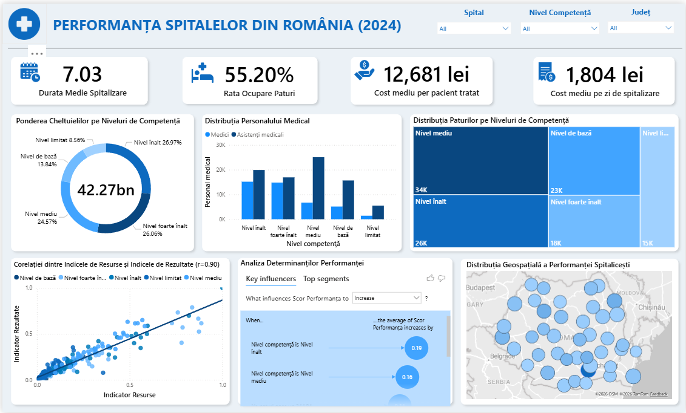
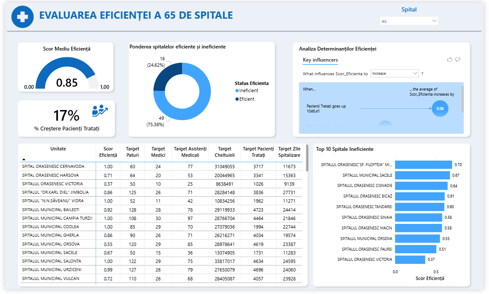

# Healthcare Performance & Efficiency Decision Support System (Romania, 2024)

Interactive analytics system for evaluating the performance and efficiency of Romanian public hospitals using **PCA, Cluster Analysis, DEA, and Power BI**.

## Business Problem

Romanian public hospitals face persistent resource constraints, but an equally important question is whether existing resources are used efficiently. This project was developed to support evidence-based decision-making in the healthcare sector.

## Key Results

* Analyzed **121 public hospitals**
* Identified **3 homogeneous hospital clusters**
* Evaluated efficiency for **65 comparable hospitals**
* Average bed occupancy rate: **55.2%**
* Basic hospitals occupancy rate: **48%**
* Resource–result correlation: **r = 0.90**

## Methodology

1. Data cleaning and validation
2. Principal Component Analysis (PCA)
3. Cluster Analysis (k-means)
4. DEA BCC output-oriented efficiency analysis
5. Interactive Power BI dashboards

## Analytical Decisions

* Removed 5 atypical hospitals after outlier investigation
* Standardized variables before clustering
* Selected **k = 3** using Elbow and Silhouette methods
* Applied DEA only within the homogeneous cluster to improve comparability

## Dashboards

### Performance Dashboard

### DEA Dashboard

## Repository Structure

* `README.md` – project overview
* `thesis_summary.pdf` – thesis summary
* `performance_dashboard.png` – performance dashboard
* `dea_dashboard.png` – DEA dashboard
* `pca.R` – PCA analysis script
* `cluster.R` – clustering analysis script
* `dea.R` – DEA analysis script

## What I Learned

The main lesson was that sophisticated models cannot compensate for poor data comparability. I initially applied DEA to all hospitals and obtained misleading benchmarks, which led me to redesign the workflow and introduce clustering before efficiency analysis.

## Tools

**R, Power BI, PCA, k-means, DEA BCC, Data Visualization**

---

Bachelor thesis project developed at the Bucharest University of Economic Studies (ASE).
